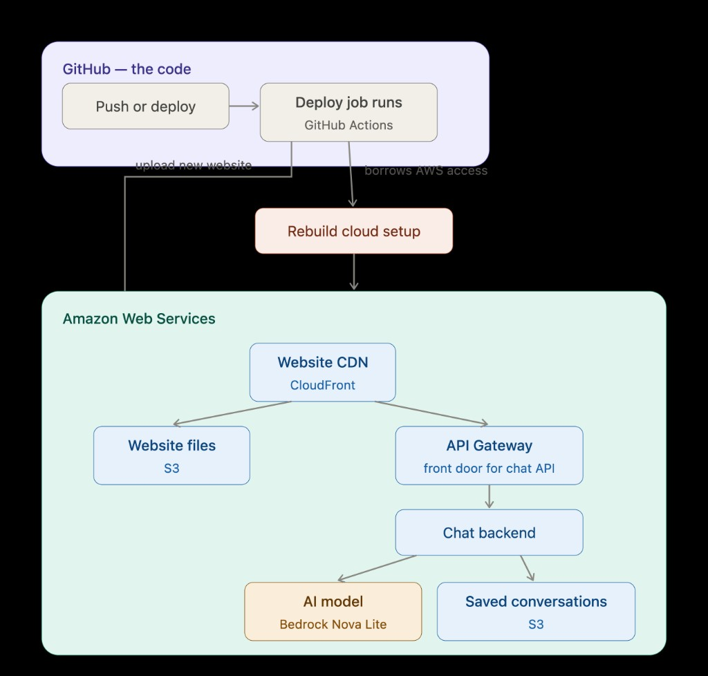

# Twin

A project about putting a chat-with-an-AI app **on the real internet**, using Amazon’s cloud — not just running it on my laptop.

Twin is a **digital twin**: a website where you can talk to an AI that is supposed to sound like [me](https://github.com/rinster). It is briefed with my professional background, LinkedIn material, and notes on how I communicate. It should stay professional and **not make up facts** it was never given.

I did not invent this architecture from scratch. I **set it up, shipped it, and unstuck it** when deployment broke. The useful learning was the last mile: the chat worked locally; getting GitHub to update a live site on AWS did not, until I chased down a string of real-world failures.

---

## Tech Stack

I wanted to see what it takes to run a large language model (LLM) as a **product**, not a demo:

- The AI runs **on Amazon’s side**, with cloud permissions — not a secret key sitting in the website. Using AWS Bedrock make it easier to deploy top-tier AI models instantly via a single API, requiring zero infrastructure management and a cost-effective.
- The conversation is **remembered** even though the server that answers you is temporary.
- There are separate copies of the app for practice (**dev**), staging (**test**), and the real one (**prod**).
- With **Terraform** and **Github Actions** Updates go out when I push code, not by clicking around in a console.

Talking to the bot on my machine was the easy part. Getting an automatic pipeline to rebuild, permission, and publish it was the point.

---

## What a visitor sees

You open a webpage, type a message, and get a reply in my voice. Behind that:

1. The **website** is a simple chat screen (built with Next.js).
2. Your message goes to a **small API** (FastAPI) that lives on AWS Lambda — a computer that only runs when someone talks to it.
3. That API asks **Amazon Bedrock** (Amazon’s hosted AI models) for the next reply, and includes earlier messages so the chat has continuity.
4. The thread is saved in a **private file store** (S3) so the next message can pick up where you left off.

The AI is not a generic assistant. It is given a packet of who I am and told not to invent a biography.

---

## How the pieces connect

In plain language: **GitHub** holds the code. When I deploy, GitHub temporarily borrows permission to use my **AWS** account, rebuilds the app, and publishes a new version of the website and the chat backend.

A push to the main branch updates **dev**. **Test** and **prod** are deliberate promotions — I choose them in GitHub — so the live site is not every experiment.

---

## Tools involved

| Everyday name | What's used | Description |
| --- | --- | --- |
| The webpage | Next.js | A modern website, exported as ordinary files a CDN can host |
| The chat server | FastAPI on Lambda | Python that runs only when someone sends a message |
| The AI | Amazon Bedrock (Nova) | Amazon-hosted model; my AWS account is billed, not a public chatbot key in the page |
| Memory | S3 | Private storage for each conversation |
| Cloud blueprint | Terraform | A written description of servers, storage, and permissions so they can be recreated |
| Automatic shipping | GitHub Actions | A checklist that runs on GitHub’s machines when I deploy |
| Logging into AWS | OIDC | GitHub proves who it is and **borrows a role**. No long-lived AWS password stored in GitHub |

---

## What production meant for the AI

- **Stay on-script.** Replies are based on a prepared brief (facts, LinkedIn, tone), not whatever the model feels like inventing.
- **Remember the thread.** The backend forgets everything when it finishes a request; the saved files are what make a conversation feel continuous.
- **Don’t let the internet run up an infinite bill.** The public chat door has speed limits, tighter in practice environments than in prod. Choosing the right model for the correct situation can mean effective cost savings or emptying your wallet.

---

##  Building CI/CD in action

1. I trigger **GitHub Actions** (or push to main for dev). GitHub asks AWS, “May I act as the deploy role?” AWS says yes only if the request really came from this repo.
2. A script packages the Python chat app for Lambda.
3. Terraform reads the blueprint and creates or updates the AWS pieces: backend, API door, file storage, website hosting, permissions.
4. The website is built and uploaded. The chat page is told the live API address.
5. The CDN cache is cleared so visitors are not looking at yesterday’s page.

There is a separate **destroy** button that only runs if I type the environment name. That is on purpose — prod should be hard to delete by accident.

---

## What I actually spent time on

The design looks tidy. Getting it live did not. These are the kinds of bugs I had to chase — written so a non-engineer can see *why* they were painful, with the technical names in parentheses.

- **GitHub was locked out of AWS even though the “password” looked right.** GitHub now identifies repos with extra ID numbers in its handshake. The AWS permission list expected the old name-only format, so login was refused. I had to read AWS’s audit log (CloudTrail) to see what GitHub actually sent.
- **The “memory of the cloud setup” lived in California; the robot looked in Virginia.** AWS regions are physical places. A setting of `us-east-1` while the files were in `us-west-1` made Terraform look healthy, then fail on the next step with a redirect error.
- **My Mac is Apple silicon; the Terraform I installed was the Intel edition.** It tried to run a huge AWS plugin through a translator (Rosetta) and timed out. It looked like a flaky tool. It was the wrong chip.
- **Production settings never made it to GitHub.** A file of prod knobs was on my laptop but listed as “don’t upload.” The deploy job asked for that file and crashed because GitHub never had it.
- **AWS built the storage, then the upload had no name to send files to.** The blueprint created buckets but never *exported* their names. The website copy command ran against an empty address — after the “hard” create had already succeeded.
- **A one-line config made every AWS command look like “no results.”** The AWS command-line tool was set to an invalid output type (`None`). Listings appeared empty; they were actually the tool crashing.

That mix — permissions, geography, chip architecture, what Git ignores, missing names, a bad default — is what “putting an LLM in production” felt like. Twin is the repo where I stayed with those problems until **dev**, **test**, and **prod** actually deployed.

---

## What I took away

Buliding a simple chat bot is only one small part of AI integration. Most of the work is in bulding system architecture, deployment, maintenance and debugging weird errors. Deployment was something I didn't have much experience in since the AWS console was so massive and confusing to navigate. I'm saying this even after taking a few AWS certifcate courses 🥲 Terraform, however makes it simple with the right setup and configuration files. 
